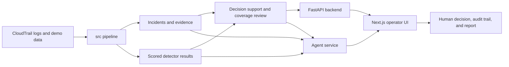

# Cyber Security Co-Pilot

Cyber Security Co-Pilot is a human-in-the-loop incident response system for cloud security.

Its core value is not just recommending an action. It also shows what evidence was checked, what was not checked, and when the recommendation may be incomplete, so a non-expert operator can make a safer decision.

## What Makes This Different

Most security copilots focus on giving a better answer.

This project focuses on making incomplete reasoning visible.

For each incident, the system:
- summarizes what happened in plain language
- recommends an action
- shows 2-3 alternatives with tradeoffs
- exposes blind spots such as evidence that was not checked or could not be checked
- lets a human approve, choose an alternative, ask for more analysis, or escalate
- records the decision and generates an audit report

That blind-spot visibility is the main product differentiator.

## What A Judge Should Understand Quickly

This is a decision-support product for security operations, not just a detection model and not just a chatbot.

The main workflow is:
1. ingest cloud activity
2. form an incident
3. generate a recommended action and alternatives
4. show checked vs not checked evidence
5. let a human choose
6. log the decision trace and generate a report

The project is successful when a non-expert can answer four questions from the UI:
1. What happened?
2. What should I do?
3. What else could I do?
4. Did we check everything?

## Demo Story

The strongest demo path is an incomplete incident.

Example:
1. the system sees suspicious login and follow-on activity
2. it recommends resetting credentials
3. it clearly shows that a key branch such as network evidence was not checked
4. it warns that the recommendation may be incomplete
5. the operator uses the double-check flow or chooses a safer alternative
6. the system logs that decision and produces a report

That is the value: not just a recommendation, but visible uncertainty and visible blind spots.

## Demo Talking Points

Use this framing in a live demo:

1. A threat hits and Sentinel alerts the operator.
2. The operator is not expected to be a security expert.
3. Sentinel explains the issue in plain language.
4. Sentinel shows the recommended action and alternatives.
5. Sentinel makes missing evidence impossible to miss.
6. The operator chooses a response and Sentinel generates the report automatically.
7. If the incident is severe, the expert view exposes the raw logs, model evidence, and full audit trail.

The message for a judge is simple:
Sentinel is not just finding threats. It is helping the right person make the right decision quickly, even under incomplete information.

## Architecture At A Glance

The repo has five major parts:

- [`src`](C:/Users/ejtal/Downloads/judgment_drift/Cyber-security-co-pilot/src): ingestion, normalization, feature derivation, incident building, training, demo generation, services, repositories, and agent logic
- [`backend`](C:/Users/ejtal/Downloads/judgment_drift/Cyber-security-co-pilot/backend): FastAPI core API for incidents, decision support, coverage review, operator actions, and reports
- [`frontend`](C:/Users/ejtal/Downloads/judgment_drift/Cyber-security-co-pilot/frontend): Next.js operator interface with simple and expert views
- [`agent_backend`](C:/Users/ejtal/Downloads/judgment_drift/Cyber-security-co-pilot/agent_backend): separate agent service for grounded incident Q&A
- [`decision_support`](C:/Users/ejtal/Downloads/judgment_drift/Cyber-security-co-pilot/decision_support): decision-engine package

Supporting folders:
- [`configs`](C:/Users/ejtal/Downloads/judgment_drift/Cyber-security-co-pilot/configs): pipeline and policy configuration
- [`scripts`](C:/Users/ejtal/Downloads/judgment_drift/Cyber-security-co-pilot/scripts): local startup utilities
- [`tests`](C:/Users/ejtal/Downloads/judgment_drift/Cyber-security-co-pilot/tests): unit and integration tests
- [`data`](C:/Users/ejtal/Downloads/judgment_drift/Cyber-security-co-pilot/data): raw, processed, and demo data

### Short Architecture Diagram



## Key Features

- End-to-end CloudTrail pipeline from raw logs to incidents
- Incident scoring with explainable model outputs
- Coverage and blind-spot tracking by evidence category
- Decision-support engine with recommendations and alternatives
- Human decision audit trail and incident report generation
- Grounded incident agent using OpenAI-compatible APIs
- Operator UI with simple and expert workflows

## Fastest Way To Run The Demo

### Prerequisites

- Python 3.10+
- PostgreSQL
- Node.js
- optional OpenAI-compatible API key for live agent mode

### Install

```bash
pip install -r requirements.txt
```

For the frontend:

```bash
cd frontend
npm install
```

### Start The Local Stack

From the project root on Windows:

```powershell
.\scripts\start_local.ps1
```

This starts the local backend services for the operator workflow.

If you need to stop them:

```powershell
.\scripts\stop_local.ps1
```

### Launch The Frontend

```bash
cd frontend
npm run dev
```

Open:

- UI: `http://127.0.0.1:3000`

## What To Click In The UI

Recommended judge flow:

1. open an incident from the left-hand queue
2. stay in `Simple` view first
3. read:
   - `What happened?`
   - `What should I do?`
   - `What else could I do?`
   - `Did we check everything?`
4. notice the `recommendation may be incomplete` warning on incomplete cases
5. use:
   - `Double check`
   - `Choose selected alternative`
   - `Approve recommendation`
6. open `View latest report`
7. switch to `Expert` view to inspect:
   - model evidence
   - raw logs
   - cyber data used for the decision
   - agent panel

## Main API Surface

Core incident workflow:
- `GET /incidents`
- `GET /incidents/{incident_id}`
- `GET /incidents/{incident_id}/decision-support`
- `GET /incidents/{incident_id}/coverage-review`
- `POST /incidents/{incident_id}/approve`
- `POST /incidents/{incident_id}/alternative`
- `POST /incidents/{incident_id}/escalate`
- `POST /incidents/{incident_id}/double-check`
- `GET /incidents/{incident_id}/operator-history`
- `GET /incidents/{incident_id}/report/latest`
- `GET /incidents/{incident_id}/report/latest/pdf`

Agent workflow:
- `GET /incidents/{incident_id}/agent-auth`
- `POST /incidents/{incident_id}/agent-query`

## Model And Explanation Notes

The current scoring pipeline supports an explainable model path with a logistic fallback.

The system can carry:
- `model_type`
- explanation text
- feature contributions

Those explanations are surfaced in the expert workflow alongside human-readable signal summaries.

## Testing Status

The repo includes:
- Python unit and integration tests
- frontend component and page behavior tests
- proxy route tests for Next API forwarding
- live integration coverage for operator actions and report generation

Python coverage is enforced in CI.

## If You Only Read One More Document

Read [`Sentinel_Value_Proposition.md`](C:/Users/ejtal/Downloads/judgment_drift/Cyber-security-co-pilot/Sentinel_Value_Proposition.md).

That document states the product thesis most directly:
this system helps a human notice when the machine may be missing something.

## License

MIT
